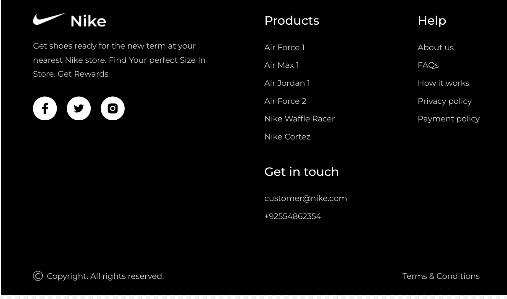

# Nike Landing Page

Nike Landing Page - a stunning Nike landing page, applying learned skills to create a visually impressive website.

## Functionalities

👉 **Maximizing Tailwind CSS**: Discover tips and tricks to make the most out of Tailwind CSS.

👉 **Understanding Tailwind Internals**: Dive into the inner workings of Tailwind, gaining insights into its structure and optimizations.

👉 **Best Practices**: Learn Tailwind's best practices for efficient and maintainable code.

👉 **Theming**:Explore techniques to add different themes to your website using Tailwind CSS.

👉 **JavaScript-like Tasks with Tailwind**: Discover how Tailwind CSS can be used to achieve tasks that typically require JavaScript code

while building a beautiful Nike Website with a,

👉 **Complex Hero Section**: A visually appealing hero section showcasing key elements.

👉 **Popular Products Showcase**: A section highlighting popular Nike products

👉 **About Us Section**: An informative "About Us" section with a unique design.

👉 **Special Offers**: Showcase special offers in an eye-catching manner

👉 **Testimonials**: A testimonials section for a captivating user experience

👉 **Newsletter Integration**: A newsletter section with Tailwind styling, encouraging user engagement

👉 **Footer**: A comprehensive footer section containing various links

👉 **Mobile Responsive**: The entire website is responsive across various devices, emphasizing Tailwind's mobile-friendly capabilities.

## Technologies Used

- Tailwind CSS
- React.js
- 
## Screenshots

## Getting Started

To run the project locally, follow these steps:

1. Clone the repository: `git clone <repository_url>`
2. Navigate to the project directory: `cd nike_landing_page`
3. Install dependencies: `npm install`
4. Start the development server: `npm run dev`